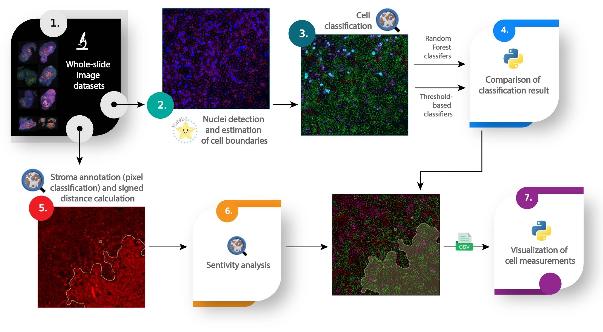

# An image analysis pipeline to quantify the spatial distribution of cell markers in stroma-rich tumors


## Overview

This repository contains the code for the image analysis pipeline used to quantify the spatial distribution of cell markers in stroma-rich tumors.

### Features

- Segmentation of nuclei in fluorescent images using pre-trained StarDist 2D
- Machine-learning based composite classification of cancer cells of interest
- Statistical propagation of classification thresholds across multiple images
- Spatial distribution using cell-stroma 2D signed distance
- Compatible with high-resolution whole-slide images
- Visualization, sensitivity and statistical analysis of results in Python

## Install dependencies

```bash
git clone https://github.com/HMS-IAC/stroma-spatial-analysis-web.git
cd stroma-spatial-analysis-web

# use uv to install dependencies
uv venv
uv pip install -r requirements.txt
```

## Datasets

[](https://zenodo.org/records/15297453)

Raw images can be downloaded from https://zenodo.org/records/15297453.


## Distribution
Our image analysis pipeline is distributed as a collection of Groovy scripts for image processing in QuPath and Python Jupyter notebooks for statistical analysis and visualization.

## Running the pipeline on your own images
To run the pipeline on your own data, follow the steps below:

1. Load your images into QuPath and create a project.
2. Run the scripts in the `qupath_scripts` folder in the following order:
    1. `stardist_cell_detection.groovy` (this step requires the StarDist extension for QuPath – the installation tutorial can be found [here](https://qupath.readthedocs.io/en/0.4/docs/deep/stardist.html))
    2. `cell_classification.groovy` if using threshold-based classification, otherwise follow [these instructions](https://qupath.readthedocs.io/en/stable/docs/tutorials/cell_classification.html#train-a-cell-classifier-based-on-annotations) from QuPath to train a machine learning classifier .
    3. `stroma_annotator.groovy` (make sure to adapt the thresholds to your images)
    4. Export measurements as a CSV file using QuPath's export feature, or using the `export_cell_measurements.groovy` script.
    5. `stroma_annotator_sensitivity.groovy` to run sensitivity analysis on the stroma annotation.
    
3. Run the Jupyter notebooks cell-by-cell in the `analysis` folder to analyze the exported measurement tables. Make sure to adapt the paths to your data and results.

## License

This project is licensed under the MIT License. See the [LICENSE](LICENSE) file for details.


## Citation

If you use this pipeline, please cite the following paper:

Ruzette AA, Kozlova N, Cruz KA, Muranen T, Nørrelykke SF. _An image analysis pipeline to quantify the spatial distribution of cell markers in stroma-rich tumors_. bioRxiv 2025.04.28.650414; doi: https://doi.org/10.1101/2025.04.28.650414
